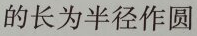
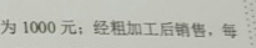

# OCR
[第一届西安交通大学人工智能实践大赛（2018AI实践大赛--图片文字识别）](http://competition.heils.cn/main.html)冠军


# 模型结果
该比赛计算每一个条目的f1score，取所有条目的平均，具体计算方式在[这里](http://competition.heils.cn/main.html)。这里的计算方式不对一句话里的相同文字重复计算，故f1score比提交的最终结果低：

|  -  | train | val | 
| :----------------: | :----------------: | :----------------: | 
| f1score   | 0.9911 | 0.9582 |
| recall    | 0.9943 | 0.9574 |
| precision | 0.9894 | 0.9637 |

# 模型说明
1. 模型

采用densenet结构，模型输入为(64×512)的图片，输出为(8×64×2159)的概率。

将图片划分为多个(8×8)的方格，在每个方格预测2159个字符的概率。

2. Loss

将(8×64×2159)的概率沿着长宽方向取最大值，得到(2159)的概率，表示这张图片里有对应字符的概率。

balance: 对正例和负例分别计算loss，使得正例loss权重之和与负例loss权重之和相等，解决数据不平衡的问题。

hard-mining

3. 文字检测
将(8×64×2159)的概率沿着宽方向取最大值，得到(64×2159)的概率。
沿着长方向一个个方格预测文字，然后连起来可得到一句完整的语句。

存在问题：两个连续的文字无法重复检测

下图是一个文字识别正确的示例：的长为半径作圆



下图是一个文字识别错误的示例：为10元；经粗加工后销售，每




# 文件目录
	ocr
	|
	|--code
	|
	|--files
	|	|
	|	|--train.csv
	|
	|--data
		|
		|--dataset
		|	|
		|	|--train
		|	|
		|	|--test
		|
		|--result
		|	|
		|	|--test_result.csv
		|
		|--images		此文件夹放置任何图片均可，我放的celebA数据集用作pretrain

# 运行环境
Ubuntu16.04, python2.7, CUDA9.0

安装[pytorch](https://pytorch.org/), 推荐版本: 0.2.0_3
```
pip install -r requirement.txt
```

# 下载数据
从[这里](https://pan.baidu.com/s/1w0iEE7q84IolmZXwttOxVw)下载初赛、复赛数据、模型，合并训练集、测试集。


# 预处理
如果不更换数据集，不需要执行这一步。

如果更换其他数据集，一并更换 files/train.csv
```
cd code/preprocessing
python map_word_to_index.py
python analysis_dataset.py  
```

# 训练
```
cd code/ocr
python main.py
```

# 测试
f1score在0.9以下，lr=0.001，不使用hard-mining；

f1score在0.9以上，lr=0.0001，使用hard-mining；

生成的model保存在不同的文件夹里。
```
cd code/ocr
python main.py --phase test --resume  ../../data/models-small/densenet/eval-16-1/best_f1score.ckpt
```
